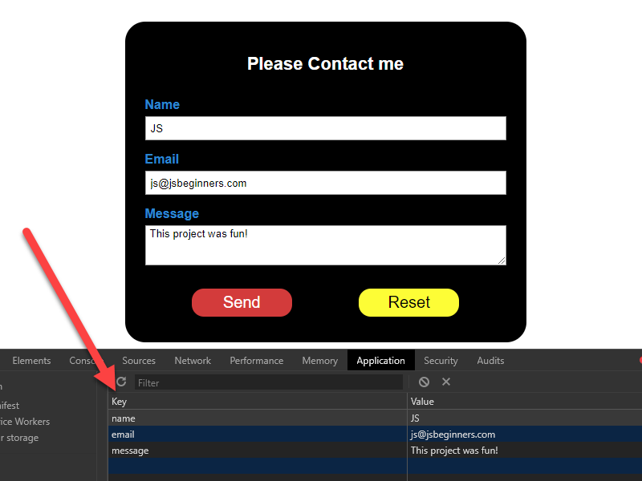

# Contact Form using Local Storage

# What You Should See
Visit the hosted github page to see this [Contact Form Using Local Storage]() in action.

# Project Objective
This project uses JavaScript to retrieve information from the text fields of a contact form and saves it into local storage. 

This project does not implement server-side scripting, so you don't have to worry about adding action and method attributes on your form.

# JavaScript Used

* eventListeners()
* DOM manipulation
* localStorage

# New Things Learned or Refreshed
Other than my own issues, I didn't learn much new JavaScript from the project other than the fact that I should always check to verify that my external files are linked to my HTML document.

I did spend quite a bit of time relearning CSS Flexbox.

When I see that the projects appear simple, I not only create the JavaScript code, I also see if I can recreate the project in its entirety, including the CSS and HTML.

So, my solutions aren't always the same as the instructors.

For this project, the instructor actually uses jQuery.

